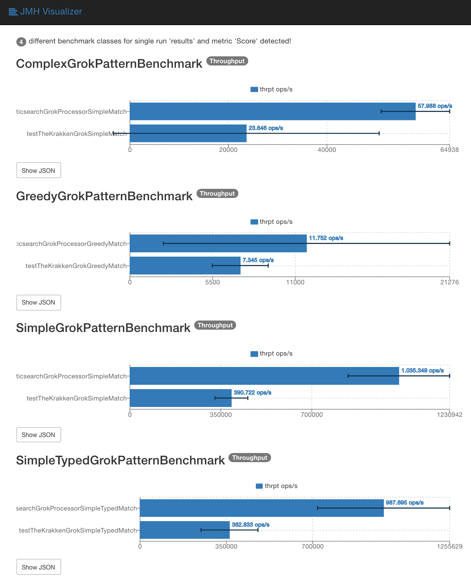

# Grok benchmarks

## Run your own benchmarks

Run the following Gradle command to generate the benchmarks:

```
./gradlew jmh
```

An HTML page for the results will be generated in `./build/reports/jmh/index.html`,
human-readable text results are available at `.build/reports/jmh/human.txt`.

## Example output

[JMH human-readable results](benchmarks-2017-07-03T16-00-00Z.txt)

